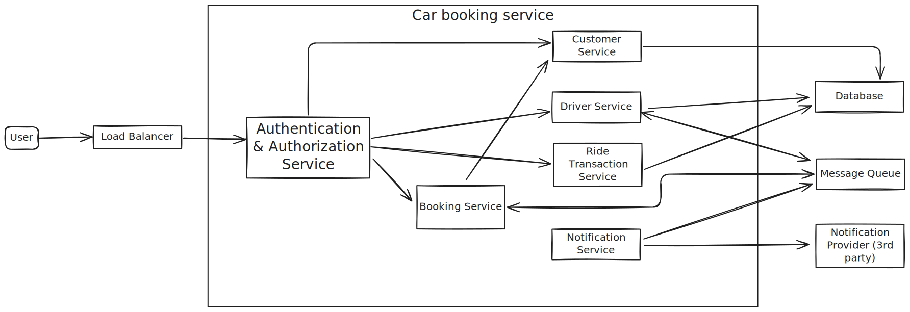
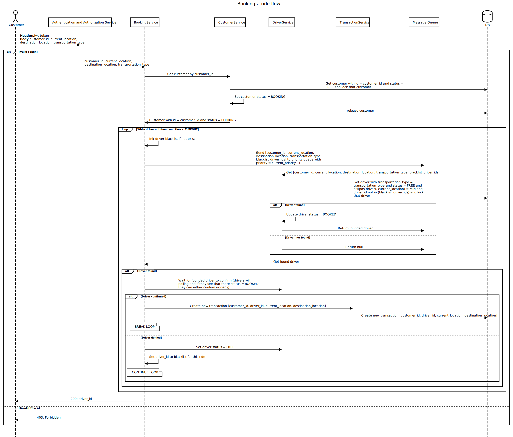
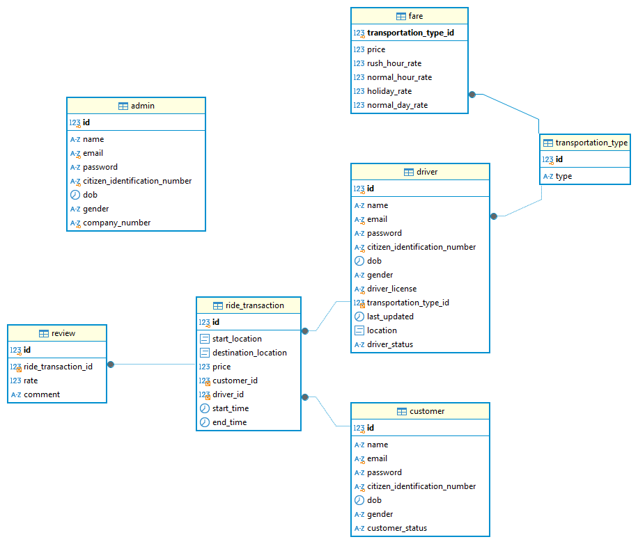

# Final Project: Car booking

## Functional requirements
- User Registration and Login:
    - The system should allow users to create an account by providing password, phone number, and personal details (e.g., name, dob information).
    - Users should be able to log in using their registered username and password.
    - Users can modify their information
    - Users can be either Drivers or Customers
    - Driver have to created with their vehicle information
- Admin control:
    - Admins should be able to block/delete users
    - Admins should be able to manage user accounts, view booking details, and access reports on booking statistics, revenue, and user feedback.
- Booking a Car:
    - Users can book a vehicle from current position to destination position
    - The system should calculate and display the total rental cost based on the selected dates and daily rental rate.
    - Users can wait max up to 30 seconds to check if any driver is available
    - Users can receive notifications after the ride is finished.
- Booking History and Status Tracking:
    - Users should be able to view their booking history, showing past and current bookings, dates, total charges, and booking statuses.
    - Users should be able to track active bookings, including pickup and drop-off schedules.
- Review:
    - Users can write review and rate driver after every transaction

## Non Functional requirements
- The system should log all booking transactions with a retention period of 1 year.
- The system should ensure that no bookings are duplicated or lost during transactions, even in case of system failures.
- The system should priority drivers with higher rate point
- The system should priority customers with longer wait time.

## Technical Details
- User Registration and Login:
    - The system support login by token (JWT)
    - The system save hashed passwords
    - The system return both refresh token and access token for every login. Refresh token can be used to re-create an access token.
    - Admin is just a user with high priority. No need to seperated between entities user and admin
- Booking a Car:
    - Drivers update their position every 30 seconds
    - When a user books a drive, the system looks for nearest driver and assign that driver for user.
        -  If the distance of nearest driver and user > MAX_ALLOW_DISTANCE, cancel that transaction. Keep looking again
        -  The distance between user and driver = distance(pos(user) - post(driver)) + driver_average_rate. It means that even a driver 
           is nearer to a customer, the system can assign to a farther driver if that driver is rated low
    - The system will support long polling for this api (up to 30 seconds)
    - The system searches for matched driver up to 2 seconds. If timeout, the system, searches again for one with higher priority
    - Users booking request and matched drivers will be exchanged over Message Queue (Even service are monolithic). If the system is monolithic, the system could use an in-memory Message Queue (implemented by Queue) else the system use a distributed Message Queue (RabbitMQ)
    - Notifications will be sent async (Message Queue). The system will use 3rd providers to send notifications.
- Booking History and Status Tracking:
    - The system saved car history and allow user to view
    - The system cached information about transaction in the last 1 year.
    - The system indexing for searching

## Components diagram


- User: user can be either Driver/Customer
- Load Balancer: system load balancer
- Authentication & Authorization Service: Service do authentication and authorization
- Customer Service: Service save and get information about Customer/Admin
- Driver Service: Service save and get information about Driver
- Ride Transaction Service: Service save and get information about every ride
- Notification Service: Service call 3rd provider to send notification
- Notification Provider: 3rd party that do the sending notifications
- Message Queue: Message queue that do async requests
- Database: RDMS database
- Booking Service: Service that coordinating a ride (check user location, find matched driver location)

## Main flows
### Booking a ride flow
[](https://sequencediagram.org/index.html?presentationMode=readOnly#initialData=C4S2BsFMAICEHt4GsQDsDm0CG0BOIATGAM3HgHcAoSrAY2Hl2gGEBXAZwYFtJdKAHLLlC0Qg1MGgAiAIKtgAC0gSQtLKHipsqAtDmLGIAF7qQm6AGVeAN1WQp2dnvkKruW7UgChIsVglwiCgYbh5egsKqfgFsnPA8uKF23pGi4pIAIvjWvEmeKb7p0AAquP7sdBqoeeE+UUVSALKQ7BXoMACKrJDdDlhOjR2UBOpYAEb9MBmw1LHcvNAAtAB8zoo1AFzQAFTbABKQWES47LtbAFLkkgxIygA6qAA85IwE5GX8GwCsAAzLuwgCABPM7QWgcea4AD6hAANGDWLhcMpgFCyGoqvCiJw0KZNGj4BizKh4cAyqh2PxGMA8agocAgfxII8APQvXBvD7LahYcCSABqvMIJWQyko+lcNjsS1WCGQaHQm2er3eWE+v2W4LiCRhBHh4KRKIJRM0WJaoFQtONtNJ5Mp1KtDKZrPZnLV3LlwUVUs8MpYEPiuR9kC2AHFIJItZDoGMgQjtbxdZQ5oHEsG-dMtsqOar1X9w5GAwloOQwApoMKALzxyG67S6TjqDjQasAMQASgBRTv16DopDQRTqGupl0qrnJotB9zSlb+hNpmeeLZWQsL6CN4DN6uwADyu4A0gBJAByocnC5qGdgW2RUEmI4SF8hV7nnoVm3n0dLigrumrUapnW-gNjSW5ODu+7HmelBkPA-DQAA6goIBQNABDZAsqDwJIxDwKwOi9qAPDQI8JRHo0na7gAqsUlDviE6ZvkEH7BlsR6oGA6GYUwYzgHQSDgCAnAVsQ0DYZIkAAB7CcA9EsYxS4wHOgxZq6ubfH8ViEQA2oBOpwgihoSNamLoeauJVKZxK2uUVLCI6jKQPCfECUJnBQhhIA5NChDsAAuoO8DQPw+CGAy0AAI7dN0JZliFYX4BFAGIsiJmhWYSVAncADUuVjjmE5ZN505hKRizQKp0AFtAelTr5epGWlqLoja5k4paVmtWZZJ2Q6VlOs5Mb8bQgmyZ5PG6gFlDFT5r6rJmpHqR8mnLDVXk+XFv69RS9lgcS9JOS2g52ntjlMr2m7btAHbdr2BDCQAFFS7CPRtvAAJT6qlRrdcSH3HY0p73ZNwoSRWWiPa5o3uai70NewAMgX2hIDkOkjwwVbr8NyvKZDx0B4QRBAzTx83QLNpV2Fs1H8CMwAwPDG5gdde6Hp2GSkyVi5lSpHRbO2EaIloRM6JAujw5QkDgOwUwE+Dosk5TPOzqsVWC1uuBaKgrDgOAUs6PJ8qKWVjwVVVNWK9x3M0HyFME4rRteuTytKstaqrYhWBcXhTCK+L1ubQwYKaMQIC4Fw0BvTxTilnrIXwHrCq9iAYmKJAcayzA6ODkoyLM02EFwFBHO5xnYL+NAkBlgstCh+HkeMOZqBAh9WO5rjdvKyHqBhxH4tO6xSl+qU5SVMSn7MMi6gwKgkDkCdY-0MStX6Ymhnw7q33GS1hJtdiFpWn9mj+ZQo8UuPmguzeLDTwz4nz4vF-L+YdULlvgfr41BrNdZprtYfLqe8qinwkjAeAm0GLeiUlsWAXYZAHmgAAGX3AABSljLOW3Nm4gAHlAl2ZM2KWAjJ-JgV0i63U7IPE2qtAjG2gWEFcJDN7CmDtDMaIlfa52EngQgXgwHQAgQsfBRDmC7hPMUU81EewoN3Og5QJMFEGxJiI4ec4UwJC2AAJh+D8LYO0KgvzpIQDBstoAcWsEKXQxRRSoHFC4cmGjeBbAACw-AAMxbFbIwMYhAiBaGUUAA)

## Databases design
### ER diagram

### Schema
```
CREATE TABLE `customer`(
	id bigint PRIMARY KEY AUTO_INCREMENT,
	`name` varchar(32) NOT NULL,
	`email` varchar(128) NOT NULL UNIQUE,
	`password` varchar(1024) NOT NULL,
	`citizen_identification_number` varchar(32) NOT NULL UNIQUE,
	`dob` datetime NOT NULL,
	`gender` ENUM ('MALE', 'FEMALE', 'OTHERS') NOT NULL,
	`customer_status` ENUM('NOT_BOOKED', 'BOOKED', 'DRIVER_ASSIGNED', 'ON_THE_WAY', 'CANCELLED') NOT NULL
);

CREATE TABLE `admin`(
	id bigint PRIMARY KEY AUTO_INCREMENT,
	`name` varchar(32) NOT NULL,
	`email` varchar(128) NOT NULL UNIQUE,
	`password` varchar(1024) NOT NULL,
	`citizen_identification_number` varchar(32) NOT NULL UNIQUE,
	`dob` datetime NOT NULL,
	`gender` ENUM ('MALE', 'FEMALE', 'OTHERS') NOT NULL,
	`company_number` varchar(32) NOT NULL UNIQUE
);

CREATE TABLE `driver`(
	id bigint PRIMARY KEY AUTO_INCREMENT,
	`name` varchar(32) NOT NULL,
	`email` varchar(128) NOT NULL UNIQUE,
	`password` varchar(1024) NOT NULL,
	`citizen_identification_number` varchar(32) NOT NULL UNIQUE,
	`dob` datetime NOT NULL,
	`gender` ENUM ('MALE', 'FEMALE', 'OTHERS') NOT NULL,
	`driver_license` varchar(128) NOT NULL UNIQUE,
	`transportation_type_id` int NOT NULL,
	last_updated timestamp NOT NULL,
	location POINT NOT NULL,
	`driver_status` ENUM('NOT_BOOKED', 'ASSIGNED', 'ON_THE_WAY', 'CANCELLED', 'OFFLINE')
);

CREATE TABLE transportation_type(
	id int PRIMARY KEY AUTO_INCREMENT,
	`type` varchar(128) NOT NULL
);

CREATE TABLE review(
	id bigint PRIMARY KEY AUTO_INCREMENT,
	ride_transaction_id bigint NOT NULL,
	rate int CHECK (rate >= 1 AND rate <= 10) NOT NULL,
	`comment` VARCHAR(128)
);

CREATE TABLE fare(
	transportation_type_id int NOT NULL PRIMARY KEY,
	price double NOT NULL,
	rush_hour_rate double NOT NULL,
	normal_hour_rate double NOT NULL,
	holiday_rate double NOT NULL,
	normal_day_rate double NOT NULL
);

CREATE TABLE `ride_transaction`(
	id bigint PRIMARY KEY AUTO_INCREMENT,
	`start_location` POINT NOT NULL,
	`destination_location` POINT NOT NULL,
	price double NOT NULL,
	customer_id bigint NOT NULL,
	driver_id bigint NOT NULL,
	`start_time` timestamp NOT NULL,
	`end_time` timestamp NOT NULL
);

ALTER TABLE `driver` ADD CONSTRAINT transportation_type_driver_pk FOREIGN KEY (transportation_type_id) REFERENCES transportation_type(id);
ALTER TABLE `fare` ADD CONSTRAINT transportation_type_fare_pk FOREIGN KEY (transportation_type_id) REFERENCES transportation_type(id);
ALTER TABLE `ride_transaction` ADD CONSTRAINT customer_ride_transaction_pk FOREIGN KEY (customer_id) REFERENCES customer(id);
ALTER TABLE `ride_transaction` ADD CONSTRAINT driver_ride_transaction_pk FOREIGN KEY (driver_id) REFERENCES driver(id);
ALTER TABLE `review` ADD CONSTRAINT ride_transaction_review_pk FOREIGN KEY (ride_transaction_id) REFERENCES ride_transaction(id);
```